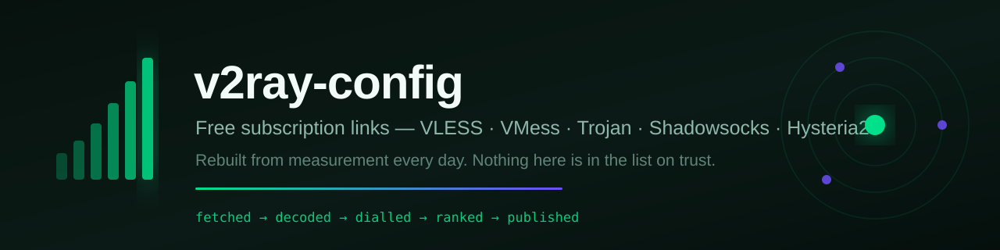
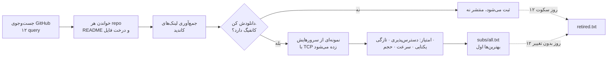

<div align="center">



# کانفیگ و ساب رایگان V2Ray — VLESS، VMess، Trojan، Shadowsocks، Hysteria2

**لیستی که هر روز از روی اندازه‌گیری دوباره ساخته می‌شود، نه یک‌بار جمع شده و رها شده.**

هر لینک اینجا دانلود، decode و ثابت شده که کانفیگ سالم دارد. هر پروکسی اینجا قبل از ورود،
یک تونل TLS واقعی به GitHub باز کرده. هیچ‌چیز روی حرف قبول نشده.

<p>
<a href="https://raw.githubusercontent.com/morpheusadam/v2ray-config/main/subs/all.txt"></a>
<a href="https://raw.githubusercontent.com/morpheusadam/v2ray-config/main/proxies/all.txt"></a>
<a href="subs/STATUS.md"></a>
</p>

[](subs/all.txt)
[](proxies/all.txt)
[](proxies/STATUS.md)

[](../../actions)
[](../../commits/main)

[English](README.md) · **فارسی** · [Русский](README.ru.md) · [中文](README.zh.md)

</div>

---

<div dir="rtl">

## لینک ساب را بردار

یکی از این‌ها را در کلاینتت وارد کن. تمام کار همین است.

</div>

**کاتالوگ ساب‌ها** — فهرست منابع، بهترین‌ها اول:

```
https://raw.githubusercontent.com/morpheusadam/v2ray-config/main/subs/all.txt
```

**لیست پروکسی** — HTTP و SOCKS4a و SOCKS5 که از شبکهٔ فیلترشده به GitHub می‌رسند:

```
https://raw.githubusercontent.com/morpheusadam/v2ray-config/main/proxies/all.txt
```

<div dir="rtl">

> [!IMPORTANT]
> فایل `subs/all.txt` فهرستی از **لینک‌های ساب** است، نه فهرستی از سرور. بیشتر کلاینت‌ها یک
> لینک می‌خواهند که خودش کانفیگ برگرداند — برای آن‌ها یکی از ردیف‌های
> [جدول برترین‌ها](#بهترین-منابع-همین-حالا) را بردار و همان را paste کن. اگر کلاینتت
> می‌تواند یک فایل پر از لینک را import کند (v2rayV، v2rayN، bulk import در NekoBox)،
> کاتالوگ را بده تا خودش همه را بکشد.

### اگر raw.githubusercontent.com پیش تو بسته است

</div>

```
https://cdn.jsdelivr.net/gh/morpheusadam/v2ray-config@main/subs/all.txt
https://raw.githack.com/morpheusadam/v2ray-config/main/subs/all.txt
```

<div dir="rtl">

همان بایت‌ها، فقط از هاست دیگر. فهرست‌های فیلترینگ که raw را می‌شناسند معمولاً این‌ها را
نمی‌شناسند.

---

## عددهای زنده

</div>

<!-- SUBS-STATS:START -->
| | |
|---|---|
| **Live subscription links** | 1548 |
| **Links on record** | 3123 |
| **Configs behind them** | 384,437+ |
| **Last rebuild** | 2026-08-10T23:00:09Z |
<!-- SUBS-STATS:END -->

<!-- PROXY-STATS:START -->
| | |
|---|---|
| **Proxies in the list** | 263 |
| **Reached GitHub on re-check** | 43% (115 of 266 drawn at random) |
| **Protocols** | http 160, socks5 90, socks4 13 |
| **Last rebuild** | 2026-08-10T21:10:22Z |
<!-- PROXY-STATS:END -->

<div dir="rtl">

جدول کامل با تاریخچه و تاریخ هر لینک: [subs/STATUS.md](subs/STATUS.md) ·
[proxies/STATUS.md](proxies/STATUS.md)

---

## کدام کلاینت؟

</div>

| کلاینت | پلتفرم | روش |
|---|---|---|
| [v2rayV](https://github.com/morpheusadam/v2rayV) | Android | برای همین لیست ساخته شده. یک‌بار دکمهٔ پاور را بزن — خودش import، تست و وصل می‌کند. |
| [v2rayN-Pro-Max](https://github.com/morpheusadam/v2rayN-Pro-Max) | Windows، Linux | نسخهٔ دسکتاپ، جایی که Auto Mode از آن شروع شد. آن هم برای همین لیست ساخته شده. |
| [v2rayNG](https://github.com/2dust/v2rayNG) | Android | تنظیمات ساب ← **+** ← paste |
| [v2rayN](https://github.com/2dust/v2rayN) | Windows، macOS، Linux | Subscriptions ← Add ← paste |
| [NekoBox](https://github.com/MatsuriDayo/NekoBoxForAndroid) | Android | Groups ← **+** ← Subscription |
| [Hiddify](https://github.com/hiddify/hiddify-next) | همه | New profile ← From URL |
| [sing-box](https://github.com/SagerNet/sing-box) | همه | هر ابزاری که ساب را تبدیل کند |
| [Clash Meta / Mihomo](https://github.com/MetaCubeX/mihomo) | همه | به converter نیاز دارد — اینجا URI خام منتشر می‌شود نه YAML کلش |
| [Streisand](https://apps.apple.com/app/streisand/id6450534064) · [V2Box](https://apps.apple.com/app/v2box-v2ray-client/id6446814690) | iOS | Add subscription ← paste |

<div dir="rtl">

---

## بهترین منابع همین حالا

بر اساس امتیاز پایین، هر روز بازسازی می‌شود. هرکدام را مستقیم در کلاینت بگذار.

</div>

<!-- SUBS-TOP:START -->
| # | Score | Subscription link | Configs | Reachable |
|---|---|---|---|---|
| 1 | **98** | `https://raw.githubusercontent.com/Delta-Kronecker/V2ray-Config/refs/heads/main/config/tcp-pass/batch_013.txt` | 413 | 100% |
| 2 | **96** | `https://raw.githubusercontent.com/Delta-Kronecker/V2ray-Config/refs/heads/main/config/tcp-pass/batch_014.txt` | 292 | 100% |
| 3 | **96** | `https://raw.githubusercontent.com/coldwater-10/V2ray-Config/main/Sub7.txt` | 586 | 100% |
| 4 | **95** | `https://raw.githubusercontent.com/sevcator/5ubscrpt10n/main/mini/m1n1-5ub-69.txt` | 390 | 100% |
| 5 | **95** | `https://raw.githubusercontent.com/Delta-Kronecker/V2ray-Config/refs/heads/main/config/tcp-pass/batch_015.txt` | 293 | 100% |
| 6 | **95** | `https://raw.githubusercontent.com/TheCrowCreature/v2rayExtractor/refs/heads/main/trojan.html` | 335 | 100% |
| 7 | **95** | `https://raw.githubusercontent.com/coldwater-10/V2ray-Config/main/Sub10.txt` | 596 | 100% |
| 8 | **94** | `https://raw.githubusercontent.com/Delta-Kronecker/V2ray-Config/refs/heads/main/config/tcp-pass/batch_001.txt` | 360 | 100% |
| 9 | **94** | `https://raw.githubusercontent.com/Delta-Kronecker/V2ray-Config/refs/heads/main/config/tcp-pass/batch_003.txt` | 354 | 100% |
| 10 | **94** | `https://raw.githubusercontent.com/Delta-Kronecker/V2ray-Config/refs/heads/main/config/tcp-pass/batch_008.txt` | 496 | 100% |
| 11 | **94** | `https://raw.githubusercontent.com/coldwater-10/V2ray-Config/main/Sub6.txt` | 598 | 100% |
| 12 | **94** | `https://raw.githubusercontent.com/Delta-Kronecker/V2ray-Config/refs/heads/main/config/tcp-pass/batch_007.txt` | 464 | 100% |
| 13 | **94** | `https://raw.githubusercontent.com/Delta-Kronecker/V2ray-Config/refs/heads/main/config/tcp-pass/batch_011.txt` | 434 | 100% |
| 14 | **94** | `https://raw.githubusercontent.com/10Dream/sub-mod/main/sub/normal/10ium-telegram-configs-collector-trojan` | 331 | 100% |
| 15 | **94** | `https://raw.githubusercontent.com/Delta-Kronecker/V2ray-Config/refs/heads/main/config/tcp-pass/batch_010.txt` | 330 | 100% |
<!-- SUBS-TOP:END -->

<div dir="rtl">

فهرست کامل و رتبه‌بندی‌شدهٔ همهٔ منابع در [`subs/all.txt`](subs/all.txt) است.

---

## چطور ساخته می‌شود

</div>



<div dir="rtl">

کل ماجرا یک فایل پایتون است، [`harvest.py`](harvest.py)، فقط با کتابخانهٔ استاندارد، که
روزی یک‌بار با [GitHub Actions](.github/workflows/daily.yml) اجرا می‌شود. بدون سرور، بدون
دیتابیس، بدون API key.

### الگوریتم امتیاز

ترتیب تزئینی نیست. منابع بر اساس عددی بین ۰ تا ۱۰۰ مرتب می‌شوند:

</div>

```
0.34·reach + 0.20·freshness + 0.14·clean + 0.12·speed + 0.12·volume + 0.08·modern
```

| بخش | چه چیزی را می‌سنجد |
|---|---|
| **reach** | چند درصد از نمونهٔ تصادفی سرورهایش دست‌دادن TCP را کامل کردند |
| **freshness** | چند روز از آخرین تغییر محتوای *decode‌شده* گذشته. encode دوبارهٔ همان سرورها تغییر حساب نمی‌شود |
| **clean** | نصفش اینکه چقدر خودش را تکرار نمی‌کند، نصفش اینکه چقدر بقیه را تکرار نمی‌کند |
| **speed** | میانهٔ زمان دست‌دادن. عمداً وزن کم دارد — پایین‌تر توضیح داده شده |
| **volume** | چند کانفیگ دارد، تا سقف ۳۰۰ |
| **modern** | Reality و TLS و Hysteria2 و TUIC به‌جای VMess خالی روی TCP |

<div dir="rtl">

**چرا سرعت تقریباً بی‌اثر است.** مرتب‌کردن سرورها با ping اینجا *بدتر از تصادفی* اندازه‌گیری
شد. سریع‌ترین جواب‌دهنده‌ها در عمل CDN edge هایی بودند جلوی هاست‌های مرده — در ۲۰ میلی‌ثانیه
دست می‌دهند و هیچ ترافیکی نمی‌برند. آنچه اتصال سالم را پیش‌بینی می‌کند دسترس‌پذیری و تازگی
است؛ latency بیشتر فاصلهٔ یک load balancer را نشان می‌دهد.

### دوازده روز، بعد بیرون

لینکی که ۱۲ روز جواب ندهد، یا ۱۲ روز تغییر نکند، از فایل بیرون می‌رود. پاک نمی‌شود — با تاریخ
و دلیلش به [`subs/retired.txt`](subs/retired.txt) می‌رود تا اگر برگشت، دوباره غریبه حساب
نشود. لینک تازه‌کشف‌شده تا وقتی به همان اندازه تماشا نشده مصونیت دارد، چون «۱۲ روز تغییر
نکرده» ادعایی دربارهٔ مشاهده است و روز اول مشاهده‌ای وجود ندارد.

---

## لیست پروکسی مسئلهٔ دیگری است

فایل [`proxies/all.txt`](proxies/all.txt) برای یک کار وجود دارد: رسیدن به GitHub از شبکه‌ای
که آن را بسته، تا کلاینت اصلاً بتواند لیست ساب را دانلود کند.

برای همین تست‌های معمول پروکسی اینجا بی‌فایده‌اند. یک ورودی فقط وقتی قبول می‌شود که تونل TLS
به `raw.githubusercontent.com:443` باز کند — **با نام، نه با IP** — و با `Range: bytes=0-15`
بایت بگیرد، آن هم زیر هشت ثانیه. نتیجه‌اش:

- SOCKS5 باید address type دامنه را بپذیرد. روی شبکه‌ای که DNS دروغ می‌گوید، دادن IP به
  پروکسی کل ماجرا را بی‌اثر می‌کند.
- SOCKS4 باید **SOCKS4a** باشد. SOCKS4 ساده اصلاً نمی‌تواند hostname حمل کند.
- HTTP باید `CONNECT` به ۴۴۳ را اجازه دهد. پروکسی‌هایی که فقط `GET` می‌دهند رایج‌ترین
  false positive یک چکر ساده‌اند و تعدادشان هم کم نیست.

عددی که اهمیت دارد **density** است: از یک نمونهٔ تصادفی فایل، چندتا در پاس دوم هنوز کار
می‌کنند. هر اجرا اندازه‌گیری و در هدر خود فایل نوشته می‌شود. تعداد یعنی کیفیت نیست — لیست
کوچکی که نصفش کار کند از لیست بزرگی که هیچ‌کدامش کار نکند بهتر است.

قالب، با scheme که همیشه نوشته می‌شود چون ورودی برچسب‌دار برای کلاینت یک handshake خرج
دارد و ورودی خالی سه تا:

</div>

```
socks5://1.2.3.4:1080 | DE | 412ms | 12d
http://5.6.7.8:3128 | NL | 780ms | 3d
```

<div dir="rtl">

هرچه بعد از اولین `|` یا فاصله بیاید metadata است و کلاینت‌ها نادیده می‌گیرند.

---

## اضافه‌کردن منبع خودت

دو فایل متنی ساده که هر دو دستی قابل ویرایش‌اند:

- [`rapo.txt`](rapo.txt) — مخزن‌های GitHub برای استخراج لینک ساب، هر خط یک
  `https://github.com/owner/repo`.
- [`proxies/sources.txt`](proxies/sources.txt) — لیست‌های پروکسی، هر خط یک URL.

یک خط اضافه کن و pull request بده. اجرای روز بعد برش می‌دارد، اثباتش می‌کند و کنار بقیه
رتبه‌بندی‌اش می‌کند. منبعی که از کار بیفتد در [proxies/STATUS.md](proxies/STATUS.md) جداگانه
گزارش می‌شود و بی‌صدا شکست نمی‌خورد — همان‌طور که بار اول سه منبع مرده همین‌طور پیدا شدند.

خودت هم می‌توانی اجرایش کنی:

</div>

```bash
python harvest.py subs search       # جست‌وجوی مخزن جدید روی GitHub
python harvest.py subs run          # جمع‌آوری، اثبات، رتبه‌بندی، بازنویسی
python harvest.py proxies run       # کل بخش پروکسی
python harvest.py subs status       # چاپ جدول رتبه‌ها
python harvest.py daily             # همه‌اش، همان که CI اجرا می‌کند
```

<div dir="rtl">

پایتون ۳٫۱۰ به بالا، بدون هیچ وابستگی. `GITHUB_TOKEN` اختیاری است و فقط سقف rate limit را
بالا می‌برد.

مشخصات فنی کامل: [standard.md](standard.md) · قرارداد پروکسی:
[proxies/PROMPT.md](proxies/PROMPT.md)

---

## سؤال‌هایی که واقعاً پرسیده می‌شود

<details>
<summary><b>رایگان است؟ زیرش چیزی هست؟</b></summary>

رایگان است، بدون اکانت، بدون ثبت‌نام، بدون telemetry. هیچ‌کدام از این سرورها را این پروژه
اداره نمی‌کند — کانفیگ‌های عمومی‌اند که آدم‌های دیگر منتشر کرده‌اند و اینجا جمع و تست شده‌اند.
ایرادش ذاتی است: سرور عمومی رایگان مشترک است، غیرقابل‌پیش‌بینی، و ممکن است یک‌شبه ناپدید شود.
دقیقاً به همین دلیل هر روز از نو ساخته می‌شود.

</details>

<details>
<summary><b>هر چند وقت آپدیت می‌شود؟</b></summary>

هر ۲۴ ساعت، ساعت ۰۳:۲۰ UTC، خودکار. بج بالای صفحه زنده از آخرین اجرا خوانده می‌شود؛ اگر
قدیمی بود یعنی job خراب است و خودت می‌بینی.

</details>

<details>
<summary><b>چه پروتکل‌هایی؟</b></summary>

VLESS (با Reality و XTLS)، VMess، Trojan، Shadowsocks، ShadowsocksR، Hysteria، Hysteria2،
TUIC، AnyTLS، Juicity، WireGuard و SOCKS — هر چه منابع بالادستی منتشر کنند. امتیازدهی
Reality و TLS و Hysteria2 را ترجیح می‌دهد، چون این‌ها در برابر active probing دوام می‌آورند
و VMess خالی روی TCP روزبه‌روز کمتر دوام می‌آورد.

</details>

<details>
<summary><b>چرا کلاینتم می‌گوید سرور پیدا نشد؟</b></summary>

تقریباً همیشه چون `subs/all.txt` را در کلاینتی paste کرده‌ای که انتظار لینکِ برگردانندهٔ
کانفیگ دارد. آن فایل فهرستی *از لینک‌ها* است. یا یکی از ردیف‌های
[جدول برترین‌ها](#بهترین-منابع-همین-حالا) را بردار، یا کلاینتی استفاده کن که کاتالوگ import
می‌کند.

</details>

<details>
<summary><b>در ایران، چین یا روسیه کار می‌کند؟</b></summary>

لینک‌ها کار می‌کنند، به شرطی که به GitHub برسی — و سخت‌ترین بخش همین است. mirror ها و لیست
پروکسی دقیقاً برای همین‌اند. دسترسی *از* شبکهٔ سانسورشده به یک سرور مشخص، تنها بخشی است که
از روی یک runner در اروپا قابل تست نیست؛ پس رتبه‌بندی را «این سرورها زنده‌اند» بخوان، نه
«این سرورها از جای تو زنده‌اند».

</details>

<details>
<summary><b>می‌شود جای دیگری هم استفاده کرد؟</b></summary>

لیست پروکسی HTTP/SOCKS معمولی است و هرجا پروکسی کار کند کار می‌کند. لطفاً اسکریپت scrape
رویش نبند — این‌ها سرورهای آدم‌های دیگرند و کوبیدنشان دقیقاً همان کاری است که ناپدیدشان
می‌کند.

</details>

---

## حقوقی و صادقانه

برای پژوهش، آموزش و رسیدن به اینترنت آزاد در جایی که محدود شده منتشر شده. هیچ‌چیز اینجا
متعلق به این پروژه نیست و توسط آن اداره یا تأیید نمی‌شود؛ هر ورودی کانفیگ عمومی‌ای است که
شخص دیگری منتشر کرده و اینجا خودکار جمع شده. هیچ ترافیکی از چیزی که من کنترل کنم عبور
نمی‌کند، و نمی‌توانم ضمانت کنم اپراتورهای این سرورها با آن چه می‌کنند — فرض را بر این بگذار
که یک پروکسی عمومی رایگان ترافیکت را می‌بیند، و برای هر چیزی که برایت مهم است رمزنگاری
سرتاسری داشته باش.

قوانینی که به تو مربوط است را رعایت کن. تحت لایسنس [MIT](LICENSE).

</div>

---

<div align="center">

**در کنار [v2rayV](https://github.com/morpheusadam/v2rayV) ساخته شده** — کلاینت اندرویدی که
همین لیست را می‌خواند و با یک فشار خودش وصل می‌شود.

اگر یک بعدازظهر برایت وقت خرید، یک ⭐ کمک می‌کند بقیه هم پیدایش کنند.

<sub>کلمات کلیدی: کانفیگ رایگان v2ray · لینک ساب رایگان · وی‌لس · وی‌مس · تروجان ·
شادوساکس · هیستریا۲ · ریالیتی · کانفیگ v2rayng · پروکسی رایگان · سوکس۵ ·
free v2ray config · vless subscription · 免费节点 · бесплатный впн конфиг</sub>

</div>
