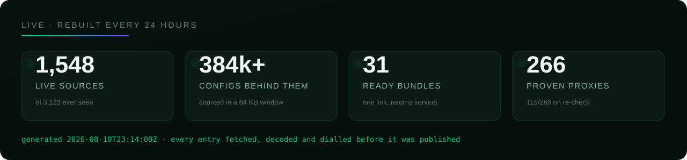
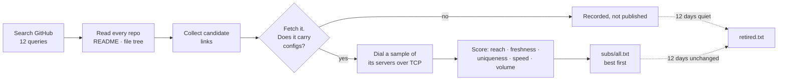
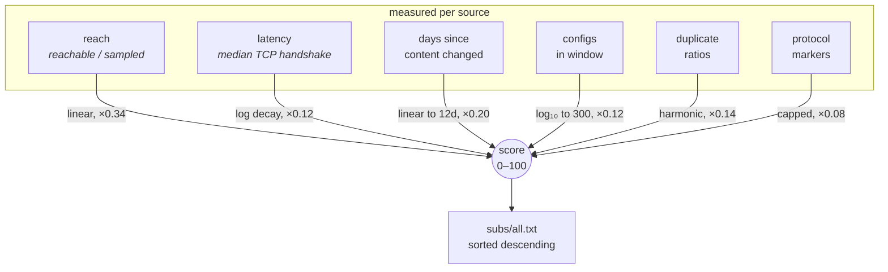
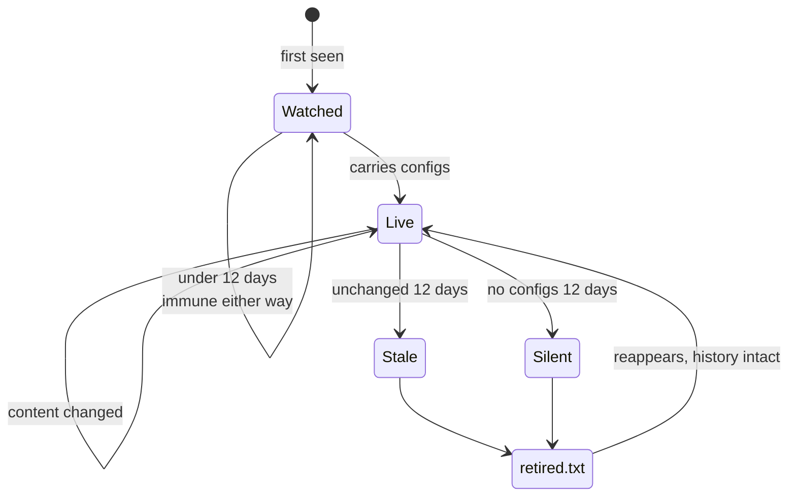
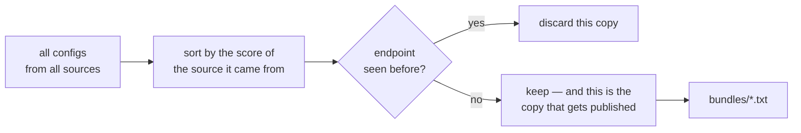
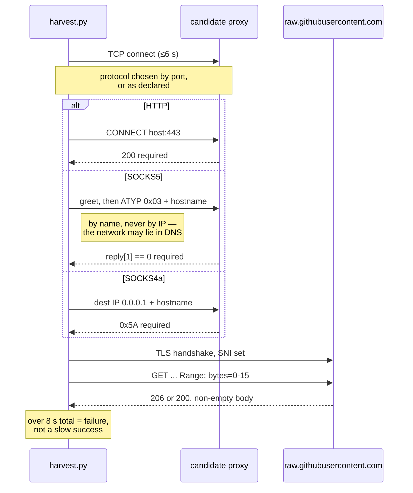

# Free V2Ray Subscription Links — VLESS, VMess, Trojan, Shadowsocks, Hysteria2

A subscription catalog for V2Ray, Xray and sing-box clients, rebuilt from measurement every
day. Every link was fetched, decoded and proved to carry working configs; every proxy opened
a real TLS tunnel to GitHub before it was allowed in. Nothing is in these files on trust.

<div align="center">


<p><b>Copy one link into your client. That is the whole setup.</b></p>

<p>


</p>

<p>
<a href="https://raw.githubusercontent.com/morpheusadam/v2ray-config/main/subs/all.txt"></a>
<a href="https://raw.githubusercontent.com/morpheusadam/v2ray-config/main/proxies/all.txt"></a>
<a href="subs/STATUS.md"></a>
</p>

<p>
<a href="subs/all.txt"></a>
<a href="proxies/all.txt"></a>
<a href="proxies/STATUS.md"></a>
<a href="../../actions"></a>
<a href="../../commits/main"></a>
<a href="../../stargazers"></a>
</p>

<sub><b>English</b> · <a href="README.fa.md">فارسی</a> · <a href="README.ru.md">Русский</a> · <a href="README.zh.md">中文</a></sub>

<br><br>



<br>

<table>
<tr>
<td width="33%" valign="top" align="center">
<h3>🎯 Just want a link</h3>
<p align="left">Paste <code>best.txt</code> into any client. 2,000 configs, only from sources that scored 85 or better.</p>
<a href="https://raw.githubusercontent.com/morpheusadam/v2ray-config/main/subs/bundles/best.txt"></a>
</td>
<td width="33%" valign="top" align="center">
<h3>🇮🇷 On a censored network</h3>
<p align="left">REALITY, XTLS-Vision, Hysteria2 and TUIC only — the protocols that survive active probing.</p>
<a href="https://raw.githubusercontent.com/morpheusadam/v2ray-config/main/subs/bundles/iran.txt"></a>
</td>
<td width="33%" valign="top" align="center">
<h3>🔧 Want everything</h3>
<p align="left">The full catalog of 1,500 proved sources, plus 31 bundles split by protocol and size.</p>
<a href="subs/bundles/index.txt"></a>
</td>
</tr>
</table>

</div>

---

## Get the subscription

<table>
<tr><th align="left" width="30%">What you want</th><th align="left">Paste this</th></tr>
<tr>
<td><b>One link that just works</b><br><sub>recommended</sub></td>
<td><code>https://raw.githubusercontent.com/morpheusadam/v2ray-config/main/subs/bundles/best.txt</code></td>
</tr>
<tr>
<td><b>A censored network</b></td>
<td><code>https://raw.githubusercontent.com/morpheusadam/v2ray-config/main/subs/bundles/iran.txt</code></td>
</tr>
<tr>
<td><b>Everything, 39k configs</b></td>
<td><code>https://raw.githubusercontent.com/morpheusadam/v2ray-config/main/subs/bundles/all.txt</code></td>
</tr>
<tr>
<td><b>Small, for a slow line</b></td>
<td><code>https://raw.githubusercontent.com/morpheusadam/v2ray-config/main/subs/bundles/lite.txt</code></td>
</tr>
<tr>
<td><b>The source catalog</b><br><sub>links, not servers</sub></td>
<td><code>https://raw.githubusercontent.com/morpheusadam/v2ray-config/main/subs/all.txt</code></td>
</tr>
<tr>
<td><b>Proxies to reach GitHub</b></td>
<td><code>https://raw.githubusercontent.com/morpheusadam/v2ray-config/main/proxies/all.txt</code></td>
</tr>
</table>

> [!IMPORTANT]
> `subs/all.txt` is a list of **subscription links**, not a list of servers. If your client
> expects one URL that returns configs — which is most of them — use a bundle instead. If it
> can import a file of links (v2rayV, v2rayN, NekoBox's bulk import), give it the catalog and
> let it pull all of them.

### Every bundle

Deduplicated by endpoint across every source, ordered so configs from the best-scoring
sources come first, split by protocol and size so a phone is not handed forty thousand
lines. Each also exists as `-base64.txt` for clients that insist on it.

<!-- BUNDLES:START -->
| Bundle | Configs | Link |
|---|---|---|
| **all** | 39368 | `https://raw.githubusercontent.com/morpheusadam/v2ray-config/main/subs/bundles/all.txt` |
| **mini** | 100 | `https://raw.githubusercontent.com/morpheusadam/v2ray-config/main/subs/bundles/mini.txt` |
| **lite** | 300 | `https://raw.githubusercontent.com/morpheusadam/v2ray-config/main/subs/bundles/lite.txt` |
| **medium** | 1000 | `https://raw.githubusercontent.com/morpheusadam/v2ray-config/main/subs/bundles/medium.txt` |
| **vless** | 16355 | `https://raw.githubusercontent.com/morpheusadam/v2ray-config/main/subs/bundles/vless.txt` |
| **vmess** | 6000 | `https://raw.githubusercontent.com/morpheusadam/v2ray-config/main/subs/bundles/vmess.txt` |
| **trojan** | 6908 | `https://raw.githubusercontent.com/morpheusadam/v2ray-config/main/subs/bundles/trojan.txt` |
| **shadowsocks** | 8735 | `https://raw.githubusercontent.com/morpheusadam/v2ray-config/main/subs/bundles/shadowsocks.txt` |
| **hysteria2** | 918 | `https://raw.githubusercontent.com/morpheusadam/v2ray-config/main/subs/bundles/hysteria2.txt` |
| **tuic** | 77 | `https://raw.githubusercontent.com/morpheusadam/v2ray-config/main/subs/bundles/tuic.txt` |
| **wireguard** | 340 | `https://raw.githubusercontent.com/morpheusadam/v2ray-config/main/subs/bundles/wireguard.txt` |
| **reality** | 6015 | `https://raw.githubusercontent.com/morpheusadam/v2ray-config/main/subs/bundles/reality.txt` |
| **tls** | 14544 | `https://raw.githubusercontent.com/morpheusadam/v2ray-config/main/subs/bundles/tls.txt` |
| **best** | 2000 | `https://raw.githubusercontent.com/morpheusadam/v2ray-config/main/subs/bundles/best.txt` |
| **iran** | 3000 | `https://raw.githubusercontent.com/morpheusadam/v2ray-config/main/subs/bundles/iran.txt` |
<!-- BUNDLES:END -->

Pick `mini` or `lite` on a slow connection, `vless` or `reality` if you know what your
network tolerates, `best` if you would rather have forty servers that work than four
thousand that might. The full index is at
[`subs/bundles/index.txt`](subs/bundles/index.txt).

### Mirrors, if raw.githubusercontent.com is blocked where you are

```
https://cdn.jsdelivr.net/gh/morpheusadam/v2ray-config@main/subs/all.txt
https://raw.githack.com/morpheusadam/v2ray-config/main/subs/all.txt
```

Same bytes, different hostnames. Block lists that name the raw host usually do not name
these.

---

## Live numbers

<!-- SUBS-STATS:START -->
| | |
|---|---|
| **Live subscription links** | 1548 |
| **Links on record** | 3123 |
| **Configs behind them** | 384,437+ |
| **Last rebuild** | 2026-08-10T23:14:00Z |
<!-- SUBS-STATS:END -->

<!-- PROXY-STATS:START -->
| | |
|---|---|
| **Proxies in the list** | 263 |
| **Reached GitHub on re-check** | 43% (115 of 266 drawn at random) |
| **Protocols** | http 160, socks5 90, socks4 13 |
| **Last rebuild** | 2026-08-10T21:10:22Z |
<!-- PROXY-STATS:END -->

Full standings, with per-link history and dates: [subs/STATUS.md](subs/STATUS.md) ·
[proxies/STATUS.md](proxies/STATUS.md)

---

## Which client?

| Client | Platform | How |
|---|---|---|
| [v2rayV](https://github.com/morpheusadam/v2rayV) | Android | Built for this list. Press power once — it imports, tests and connects on its own. |
| [v2rayN-Pro-Max](https://github.com/morpheusadam/v2rayN-Pro-Max) | Windows, Linux | The desktop sibling, where Auto Mode started. Also built for this list. |
| [v2rayNG](https://github.com/2dust/v2rayNG) | Android | Subscription settings → **+** → paste a link |
| [v2rayN](https://github.com/2dust/v2rayN) | Windows, macOS, Linux | Subscriptions → Add → paste |
| [NekoBox](https://github.com/MatsuriDayo/NekoBoxForAndroid) | Android | Groups → **+** → Subscription |
| [Hiddify](https://github.com/hiddify/hiddify-next) | All | New profile → From URL |
| [sing-box](https://github.com/SagerNet/sing-box) | All | Any tool that converts a subscription |
| [Clash Meta / Mihomo](https://github.com/MetaCubeX/mihomo) | All | Needs a converter — this repo publishes raw URIs, not Clash YAML |
| [Streisand](https://apps.apple.com/app/streisand/id6450534064) · [V2Box](https://apps.apple.com/app/v2box-v2ray-client/id6446814690) | iOS | Add subscription → paste |

---

## The best sources right now

Ranked by the score below, rebuilt every day. Paste any of these straight into a client.

<!-- SUBS-TOP:START -->
| # | Score | Subscription link | Configs | Reachable |
|---|---|---|---|---|
| 1 | **98** | `https://raw.githubusercontent.com/Delta-Kronecker/V2ray-Config/refs/heads/main/config/tcp-pass/batch_013.txt` | 413 | 100% |
| 2 | **96** | `https://raw.githubusercontent.com/Delta-Kronecker/V2ray-Config/refs/heads/main/config/tcp-pass/batch_014.txt` | 292 | 100% |
| 3 | **96** | `https://raw.githubusercontent.com/coldwater-10/V2ray-Config/main/Sub7.txt` | 586 | 100% |
| 4 | **95** | `https://raw.githubusercontent.com/sevcator/5ubscrpt10n/main/mini/m1n1-5ub-69.txt` | 390 | 100% |
| 5 | **95** | `https://raw.githubusercontent.com/Delta-Kronecker/V2ray-Config/refs/heads/main/config/tcp-pass/batch_015.txt` | 293 | 100% |
| 6 | **95** | `https://raw.githubusercontent.com/TheCrowCreature/v2rayExtractor/refs/heads/main/trojan.html` | 335 | 100% |
| 7 | **95** | `https://raw.githubusercontent.com/coldwater-10/V2ray-Config/main/Sub10.txt` | 596 | 100% |
| 8 | **94** | `https://raw.githubusercontent.com/Delta-Kronecker/V2ray-Config/refs/heads/main/config/tcp-pass/batch_001.txt` | 360 | 100% |
| 9 | **94** | `https://raw.githubusercontent.com/Delta-Kronecker/V2ray-Config/refs/heads/main/config/tcp-pass/batch_003.txt` | 354 | 100% |
| 10 | **94** | `https://raw.githubusercontent.com/Delta-Kronecker/V2ray-Config/refs/heads/main/config/tcp-pass/batch_008.txt` | 496 | 100% |
| 11 | **94** | `https://raw.githubusercontent.com/coldwater-10/V2ray-Config/main/Sub6.txt` | 598 | 100% |
| 12 | **94** | `https://raw.githubusercontent.com/Delta-Kronecker/V2ray-Config/refs/heads/main/config/tcp-pass/batch_007.txt` | 464 | 100% |
| 13 | **94** | `https://raw.githubusercontent.com/Delta-Kronecker/V2ray-Config/refs/heads/main/config/tcp-pass/batch_011.txt` | 434 | 100% |
| 14 | **94** | `https://raw.githubusercontent.com/10Dream/sub-mod/main/sub/normal/10ium-telegram-configs-collector-trojan` | 331 | 100% |
| 15 | **94** | `https://raw.githubusercontent.com/Delta-Kronecker/V2ray-Config/refs/heads/main/config/tcp-pass/batch_010.txt` | 330 | 100% |
<!-- SUBS-TOP:END -->

The full ranked list of every source lives in [`subs/all.txt`](subs/all.txt).

---

## How this is built



The whole thing is one Python file, [`harvest.py`](harvest.py), standard library only, run
once a day by [GitHub Actions](.github/workflows/daily.yml). No servers, no database, no
API keys.

### The score

Order is not decoration. Sources are sorted by a number in 0–100:

```
0.34·reach + 0.20·freshness + 0.14·clean + 0.12·speed + 0.12·volume + 0.08·modern
```

| Part | What it measures |
|---|---|
| **reach** | Share of a random sample of its servers that completed a TCP handshake |
| **freshness** | Days since the file's *decoded* contents changed. Re-encoding the same servers daily does not count |
| **clean** | Half how little the list repeats itself, half how little it repeats everyone else |
| **speed** | Median handshake time. Weighted low on purpose — see below |
| **volume** | How many configs it carries, saturating at 300 |
| **modern** | Reality, TLS, Hysteria2 and TUIC rather than bare VMess over TCP |

**Why speed barely counts.** Ranking servers by ping measured *worse than random* here. The
fastest responders turned out to be CDN edges sitting in front of dead hosts — they answer
a handshake in 20 ms and carry nothing. Reachability and freshness predict a working
connection; latency mostly predicts how close a load balancer is.

### Twelve days, then out

A link that stops answering, or stops changing, for twelve days leaves the file. It is not
deleted — it goes to [`subs/retired.txt`](subs/retired.txt) with the date and the reason, so
a source that comes back is recognised instead of rediscovered as a stranger. A newly found
link is immune until it has been watched that long, because "unchanged for twelve days" is a
claim about observation, and on day one there is none.

---

## The algorithms, in detail

Five decisions do almost all the work. Each is written out here because each one is the
answer to a specific way this could have gone wrong.

### 1. Scoring — why the weights are where they are

Each component is normalised to 0–1, then combined. The curves matter as much as the
weights, so here they are:



**Speed decays logarithmically, not linearly.**
`speed = 1 − ln(ms / 60) / ln(2000 / 60)`, clamped to 0–1. The difference between 60 ms and
200 ms is something a person feels; the difference between 1.2 s and 1.5 s is not. A linear
scale would treat those two gaps as comparable, which is wrong in both directions.

**Volume saturates.** `volume = log₁₀(1 + n) / log₁₀(301)`. Three hundred live configs in a
64 KB window is more than anyone can use, so a list with thirty thousand is not scored a
hundred times higher than one with three hundred — it is scored roughly the same, and then
has to win on reachability like everything else.

**Cleanliness is two things at once.** Half of it is how little the list repeats itself
(`unique endpoints / total configs`); half is how little it repeats everyone else. The
second half is the interesting one:

```
cross_unique = mean over endpoints of  1 / (number of sources publishing that endpoint)
```

A server that twenty lists carry contributes 0.05; one that only this source has
contributes 1.0. Aggregators that scrape each other therefore sink, and the source that
actually found something rises — which is the behaviour you want, because when the popular
server dies it dies for all twenty at once.

### 2. Why latency is almost ignored

This is the counter-intuitive one, and it is not a guess.

| Ranking strategy | Configs that then passed a real tunnel test |
|---|---|
| Lowest TCP handshake time first | **2.1 %** |
| Random order | **7.5 %** |

Ranking by ping performed **three and a half times worse than not ranking at all**. The
reason is that the fastest responders are CDN edges and load balancers sitting in front of
dead backends: they complete a TCP handshake in 20 ms and carry nothing. Reachability is
evidence; latency is mostly a measure of how close a front door is.

So TCP probing is used to *drop* hosts, never to *rank* them, and `speed` keeps a 0.12
weight purely because a 2-second handshake really is a bad sign.

### 3. Retirement — a state machine, not a rule



The immunity window is the part that is easy to get wrong. *"Unchanged for twelve days"* is
a claim about **observation**, not about the file — on the day a link is discovered there is
no observation at all, so a brand-new source cannot be judged stale. Retirement writes to
[`subs/retired.txt`](subs/retired.txt) with the date and reason rather than deleting, so a
source that returns is recognised instead of rediscovered as a stranger with no record.

### 4. Deduplication is ordered, not arbitrary

When the same server appears in forty lists, which copy gets published matters — the copies
differ in transport parameters, SNI and remarks, and some of those are wrong.



Sorting first means the surviving copy is always the one from the best-scoring source. It
costs one sort and removes a whole category of silent corruption.

### 5. Proxy validation — the full handshake, or nothing

A proxy is only useful here if it can do one specific thing: reach GitHub. So that is
exactly what is tested, end to end, with an eight-second wall clock.



Every shortcut here has a name and a victim. Accept a TCP connect and half the list hangs
forever. Accept a plain `GET` and you ship the enormous population of proxies that allow
`GET` and refuse `CONNECT`. Hand the proxy an IP instead of a hostname and it works in
testing and fails on exactly the networks this exists for.

**Then it must do it twice.** One pass measured 43 % density — nearly six in ten entries
were already dead when someone read the file. A second probe seven hours later, in a
separate run, is now required before publication.

### The number that grades all of it

Not the count of entries. This:

> Of N drawn at random from the published file, how many work **right now**?

Measured on every run, the way a client would: random sample, full check, count. It is
written into the file's own header, so the file grades itself in public. Count is vanity;
density is the product.

---

## The proxy list is a different problem

[`proxies/all.txt`](proxies/all.txt) exists for one job: reaching GitHub from a network that
blocks it, so a client can download the subscription list at all.

That makes the usual proxy check useless. An entry qualifies here only by opening a TLS
tunnel to `raw.githubusercontent.com:443` **addressed by name**, sending
`Range: bytes=0-15`, and getting bytes back — inside eight seconds. Consequences:

- SOCKS5 must accept a domain-name address. Handing a proxy an IP defeats the point on a
  network that answers DNS with a lie.
- SOCKS4 must be **SOCKS4a**. Plain SOCKS4 cannot carry a hostname.
- HTTP must allow `CONNECT` to 443. Proxies that permit only `GET` are the most common false
  positive in a naive checker, and there are a great many of them.

The number that matters is **density**: of a random sample of the file, how many still work
on a second pass. It is measured on every run and written into the file's own header. Count
is not quality — a small list where half the entries work beats a huge one where none do.

Format, with the scheme always written out because a labelled entry costs a client one
handshake and a bare one costs three:

```
socks5://1.2.3.4:1080 | DE | 412ms | 12d
http://5.6.7.8:3128 | NL | 780ms | 3d
```

Everything after the first `|` or space is metadata that clients ignore.

---

## Adding your own sources

Two plain text files, both hand-editable:

- [`rapo.txt`](rapo.txt) — GitHub repositories to mine for subscription links, one
  `https://github.com/owner/repo` per line.
- [`proxies/sources.txt`](proxies/sources.txt) — proxy lists to pull, one URL per line.

Add a line, open a pull request. The next daily run picks it up, proves it, and ranks it
alongside everything else. A source that stops working is reported per-source in
[proxies/STATUS.md](proxies/STATUS.md) rather than failing silently, which is how three dead
sources were caught the first time this ran.

You can also run it yourself:

```bash
python harvest.py subs search       # find new repositories on GitHub
python harvest.py subs run          # collect, prove, rank, rewrite
python harvest.py proxies run       # the whole proxy side
python harvest.py subs status       # print the standings
python harvest.py daily             # everything, which is what CI runs
```

Python 3.10+. No dependencies. `GITHUB_TOKEN` is optional and only raises API rate limits.

Full technical specification: [standard.md](standard.md) ·
Proxy contract: [proxies/PROMPT.md](proxies/PROMPT.md)

---

## Questions people actually ask

<details>
<summary><b>Is this free? Is there a catch?</b></summary>

Free, and there is no account, no signup, and no telemetry. None of these servers are
operated by this project — they are public configs published by other people, collected and
tested. The catch is inherent: free public servers are shared, unpredictable, and can vanish
between one day and the next. That is exactly why this rebuilds daily.
</details>

<details>
<summary><b>How often does it update?</b></summary>

Once every 24 hours, at 03:20 UTC, automatically. The badge at the top reads live from the
last run, so if it is stale, the job is broken and you can see it.
</details>

<details>
<summary><b>Which protocols are supported?</b></summary>

VLESS (including Reality and XTLS), VMess, Trojan, Shadowsocks, ShadowsocksR, Hysteria,
Hysteria2, TUIC, AnyTLS, Juicity, WireGuard and SOCKS — whatever the upstream sources
publish. The scoring prefers Reality, TLS and Hysteria2, because those survive active
probing and bare VMess over TCP increasingly does not.
</details>

<details>
<summary><b>Why does my client say "no servers" or import nothing?</b></summary>

Almost always because `subs/all.txt` was pasted into a client that expected a link
returning configs. That file is a list *of links*. Either pick a single link from the
[top table](#the-best-sources-right-now), or use a client that imports a catalog.
</details>

<details>
<summary><b>Does this work in Iran, China or Russia?</b></summary>

The links do, when you can reach GitHub — which is the hard part on those networks. That is
what the mirrors and the proxy list are for. Reachability *from* a censored network to a
given server is the one leg that cannot be tested from a CI runner in Europe, so treat the
ranking as "these servers are alive", not "these servers are alive from where you are".
</details>

<details>
<summary><b>Can I use these for something other than a VPN client?</b></summary>

The proxy list is ordinary HTTP/SOCKS and works anywhere a proxy works. Please do not point
a scraper at it — these are other people's servers, and hammering them is how they
disappear.
</details>

---

## Legal and honest

Published for research, education, and reaching the open internet where it is restricted.
Nothing here is operated, owned, or endorsed by this project; every entry is a public config
someone else published, collected automatically. No traffic passes through anything I
control, and I cannot vouch for what any of these operators do with it — assume a free
public proxy sees your traffic, and use end-to-end encryption for anything you care about.

Obey the laws that apply to you. Licensed under [MIT](LICENSE).

---

<div align="center">

**Built alongside [v2rayV](https://github.com/morpheusadam/v2rayV)** — an Android client
that reads this list and connects itself in one press.

If this saved you an afternoon, a ⭐ helps other people find it.

<sub>Keywords: free v2ray config · v2ray subscription link · vless subscription · vmess free
config · trojan config · shadowsocks free · hysteria2 subscription · reality config ·
xray config · sing-box subscription · free proxy list · socks5 proxy list · v2rayng config ·
کانفیگ رایگان · 免费节点 · бесплатный впн конфиг</sub>

</div>
