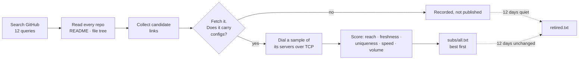

# Free V2Ray Subscription Links — VLESS, VMess, Trojan, Shadowsocks, Hysteria2

A subscription catalog for V2Ray, Xray and sing-box clients, rebuilt from measurement every
day. Every link was fetched, decoded and proved to carry working configs; every proxy opened
a real TLS tunnel to GitHub before it was allowed in. Nothing is in these files on trust.

<div align="center">


<p><b>Copy one link into your client. That is the whole setup.</b></p>

<p>


</p>

<p>
<a href="https://raw.githubusercontent.com/morpheusadam/v2ray-config/main/subs/all.txt"></a>
<a href="https://raw.githubusercontent.com/morpheusadam/v2ray-config/main/proxies/all.txt"></a>
<a href="subs/STATUS.md"></a>
</p>

<p>
<a href="subs/all.txt"></a>
<a href="proxies/all.txt"></a>
<a href="proxies/STATUS.md"></a>
<a href="../../actions"></a>
<a href="../../commits/main"></a>
<a href="../../stargazers"></a>
</p>

<sub><b>English</b> · <a href="README.fa.md">فارسی</a> · <a href="README.ru.md">Русский</a> · <a href="README.zh.md">中文</a></sub>

</div>

---

## Get the subscription

Copy one of these into your client. That is the whole setup.

**Subscription catalog** — the list of sources, ranked best first:

```
https://raw.githubusercontent.com/morpheusadam/v2ray-config/main/subs/all.txt
```

**Proxy list** — HTTP, SOCKS4a and SOCKS5 that can reach GitHub from a blocked network:

```
https://raw.githubusercontent.com/morpheusadam/v2ray-config/main/proxies/all.txt
```

> [!IMPORTANT]
> `subs/all.txt` is a list of **subscription links**, not a list of servers. Most clients
> want a single link that returns configs — for those, pick any row from the
> [top-ranked table](#the-best-sources-right-now) below and paste that instead. If your
> client can import a file of links (v2rayV, v2rayN, Nekobox's bulk import), give it the
> catalog and let it pull all of them.

### Mirrors, if raw.githubusercontent.com is blocked where you are

```
https://cdn.jsdelivr.net/gh/morpheusadam/v2ray-config@main/subs/all.txt
https://raw.githack.com/morpheusadam/v2ray-config/main/subs/all.txt
```

Same bytes, different hostnames. Block lists that name the raw host usually do not name
these.

---

## Live numbers

<!-- SUBS-STATS:START -->
| | |
|---|---|
| **Live subscription links** | 1552 |
| **Links on record** | 3123 |
| **Configs behind them** | 383,344+ |
| **Last rebuild** | 2026-08-10T22:07:29Z |
<!-- SUBS-STATS:END -->

<!-- PROXY-STATS:START -->
| | |
|---|---|
| **Proxies in the list** | 263 |
| **Reached GitHub on re-check** | 43% (115 of 266 drawn at random) |
| **Protocols** | http 160, socks5 90, socks4 13 |
| **Last rebuild** | 2026-08-10T21:10:22Z |
<!-- PROXY-STATS:END -->

Full standings, with per-link history and dates: [subs/STATUS.md](subs/STATUS.md) ·
[proxies/STATUS.md](proxies/STATUS.md)

---

## Which client?

| Client | Platform | How |
|---|---|---|
| [v2rayV](https://github.com/morpheusadam/v2rayV) | Android | Built for this list. Press power once — it imports, tests and connects on its own. |
| [v2rayN-Pro-Max](https://github.com/morpheusadam/v2rayN-Pro-Max) | Windows, Linux | The desktop sibling, where Auto Mode started. Also built for this list. |
| [v2rayNG](https://github.com/2dust/v2rayNG) | Android | Subscription settings → **+** → paste a link |
| [v2rayN](https://github.com/2dust/v2rayN) | Windows, macOS, Linux | Subscriptions → Add → paste |
| [NekoBox](https://github.com/MatsuriDayo/NekoBoxForAndroid) | Android | Groups → **+** → Subscription |
| [Hiddify](https://github.com/hiddify/hiddify-next) | All | New profile → From URL |
| [sing-box](https://github.com/SagerNet/sing-box) | All | Any tool that converts a subscription |
| [Clash Meta / Mihomo](https://github.com/MetaCubeX/mihomo) | All | Needs a converter — this repo publishes raw URIs, not Clash YAML |
| [Streisand](https://apps.apple.com/app/streisand/id6450534064) · [V2Box](https://apps.apple.com/app/v2box-v2ray-client/id6446814690) | iOS | Add subscription → paste |

---

## The best sources right now

Ranked by the score below, rebuilt every day. Paste any of these straight into a client.

<!-- SUBS-TOP:START -->
| # | Score | Subscription link | Configs | Reachable |
|---|---|---|---|---|
| 1 | **98** | `https://raw.githubusercontent.com/Delta-Kronecker/V2ray-Config/refs/heads/main/config/tcp-pass/batch_013.txt` | 413 | 100% |
| 2 | **96** | `https://raw.githubusercontent.com/coldwater-10/V2ray-Config/main/Splitted-By-Protocol/trojan.txt` | 324 | 92% |
| 3 | **96** | `https://raw.githubusercontent.com/Delta-Kronecker/V2ray-Config/refs/heads/main/config/tcp-pass/batch_014.txt` | 292 | 100% |
| 4 | **95** | `https://raw.githubusercontent.com/sevcator/5ubscrpt10n/main/mini/m1n1-5ub-69.txt` | 390 | 100% |
| 5 | **95** | `https://raw.githubusercontent.com/Delta-Kronecker/V2ray-Config/refs/heads/main/config/tcp-pass/batch_015.txt` | 293 | 100% |
| 6 | **94** | `https://raw.githubusercontent.com/Delta-Kronecker/V2ray-Config/refs/heads/main/config/tcp-pass/batch_003.txt` | 354 | 100% |
| 7 | **94** | `https://raw.githubusercontent.com/liketolivefree/kobabi/main/sub_all.txt` | 538 | 100% |
| 8 | **94** | `https://raw.githubusercontent.com/TheCrowCreature/v2rayExtractor/refs/heads/main/trojan.html` | 335 | 100% |
| 9 | **94** | `https://raw.githubusercontent.com/Delta-Kronecker/V2ray-Config/refs/heads/main/config/tcp-pass/batch_001.txt` | 360 | 100% |
| 10 | **94** | `https://raw.githubusercontent.com/Delta-Kronecker/V2ray-Config/refs/heads/main/config/tcp-pass/batch_007.txt` | 464 | 100% |
| 11 | **94** | `https://raw.githubusercontent.com/Delta-Kronecker/V2ray-Config/refs/heads/main/config/tcp-pass/batch_011.txt` | 434 | 100% |
| 12 | **94** | `https://raw.githubusercontent.com/10Dream/sub-mod/main/sub/normal/10ium-telegram-configs-collector-trojan` | 331 | 100% |
| 13 | **94** | `https://raw.githubusercontent.com/Delta-Kronecker/V2ray-Config/refs/heads/main/config/tcp-pass/batch_010.txt` | 330 | 100% |
| 14 | **94** | `https://raw.githubusercontent.com/Delta-Kronecker/V2ray-Config/refs/heads/main/config/tcp-pass/batch_002.txt` | 406 | 100% |
| 15 | **94** | `https://raw.githubusercontent.com/Delta-Kronecker/V2ray-Config/refs/heads/main/config/tcp-pass/batch_009.txt` | 488 | 100% |
<!-- SUBS-TOP:END -->

The full ranked list of every source lives in [`subs/all.txt`](subs/all.txt).

---

## How this is built



The whole thing is one Python file, [`harvest.py`](harvest.py), standard library only, run
once a day by [GitHub Actions](.github/workflows/daily.yml). No servers, no database, no
API keys.

### The score

Order is not decoration. Sources are sorted by a number in 0–100:

```
0.34·reach + 0.20·freshness + 0.14·clean + 0.12·speed + 0.12·volume + 0.08·modern
```

| Part | What it measures |
|---|---|
| **reach** | Share of a random sample of its servers that completed a TCP handshake |
| **freshness** | Days since the file's *decoded* contents changed. Re-encoding the same servers daily does not count |
| **clean** | Half how little the list repeats itself, half how little it repeats everyone else |
| **speed** | Median handshake time. Weighted low on purpose — see below |
| **volume** | How many configs it carries, saturating at 300 |
| **modern** | Reality, TLS, Hysteria2 and TUIC rather than bare VMess over TCP |

**Why speed barely counts.** Ranking servers by ping measured *worse than random* here. The
fastest responders turned out to be CDN edges sitting in front of dead hosts — they answer
a handshake in 20 ms and carry nothing. Reachability and freshness predict a working
connection; latency mostly predicts how close a load balancer is.

### Twelve days, then out

A link that stops answering, or stops changing, for twelve days leaves the file. It is not
deleted — it goes to [`subs/retired.txt`](subs/retired.txt) with the date and the reason, so
a source that comes back is recognised instead of rediscovered as a stranger. A newly found
link is immune until it has been watched that long, because "unchanged for twelve days" is a
claim about observation, and on day one there is none.

---

## The proxy list is a different problem

[`proxies/all.txt`](proxies/all.txt) exists for one job: reaching GitHub from a network that
blocks it, so a client can download the subscription list at all.

That makes the usual proxy check useless. An entry qualifies here only by opening a TLS
tunnel to `raw.githubusercontent.com:443` **addressed by name**, sending
`Range: bytes=0-15`, and getting bytes back — inside eight seconds. Consequences:

- SOCKS5 must accept a domain-name address. Handing a proxy an IP defeats the point on a
  network that answers DNS with a lie.
- SOCKS4 must be **SOCKS4a**. Plain SOCKS4 cannot carry a hostname.
- HTTP must allow `CONNECT` to 443. Proxies that permit only `GET` are the most common false
  positive in a naive checker, and there are a great many of them.

The number that matters is **density**: of a random sample of the file, how many still work
on a second pass. It is measured on every run and written into the file's own header. Count
is not quality — a small list where half the entries work beats a huge one where none do.

Format, with the scheme always written out because a labelled entry costs a client one
handshake and a bare one costs three:

```
socks5://1.2.3.4:1080 | DE | 412ms | 12d
http://5.6.7.8:3128 | NL | 780ms | 3d
```

Everything after the first `|` or space is metadata that clients ignore.

---

## Adding your own sources

Two plain text files, both hand-editable:

- [`rapo.txt`](rapo.txt) — GitHub repositories to mine for subscription links, one
  `https://github.com/owner/repo` per line.
- [`proxies/sources.txt`](proxies/sources.txt) — proxy lists to pull, one URL per line.

Add a line, open a pull request. The next daily run picks it up, proves it, and ranks it
alongside everything else. A source that stops working is reported per-source in
[proxies/STATUS.md](proxies/STATUS.md) rather than failing silently, which is how three dead
sources were caught the first time this ran.

You can also run it yourself:

```bash
python harvest.py subs search       # find new repositories on GitHub
python harvest.py subs run          # collect, prove, rank, rewrite
python harvest.py proxies run       # the whole proxy side
python harvest.py subs status       # print the standings
python harvest.py daily             # everything, which is what CI runs
```

Python 3.10+. No dependencies. `GITHUB_TOKEN` is optional and only raises API rate limits.

Full technical specification: [standard.md](standard.md) ·
Proxy contract: [proxies/PROMPT.md](proxies/PROMPT.md)

---

## Questions people actually ask

<details>
<summary><b>Is this free? Is there a catch?</b></summary>

Free, and there is no account, no signup, and no telemetry. None of these servers are
operated by this project — they are public configs published by other people, collected and
tested. The catch is inherent: free public servers are shared, unpredictable, and can vanish
between one day and the next. That is exactly why this rebuilds daily.
</details>

<details>
<summary><b>How often does it update?</b></summary>

Once every 24 hours, at 03:20 UTC, automatically. The badge at the top reads live from the
last run, so if it is stale, the job is broken and you can see it.
</details>

<details>
<summary><b>Which protocols are supported?</b></summary>

VLESS (including Reality and XTLS), VMess, Trojan, Shadowsocks, ShadowsocksR, Hysteria,
Hysteria2, TUIC, AnyTLS, Juicity, WireGuard and SOCKS — whatever the upstream sources
publish. The scoring prefers Reality, TLS and Hysteria2, because those survive active
probing and bare VMess over TCP increasingly does not.
</details>

<details>
<summary><b>Why does my client say "no servers" or import nothing?</b></summary>

Almost always because `subs/all.txt` was pasted into a client that expected a link
returning configs. That file is a list *of links*. Either pick a single link from the
[top table](#the-best-sources-right-now), or use a client that imports a catalog.
</details>

<details>
<summary><b>Does this work in Iran, China or Russia?</b></summary>

The links do, when you can reach GitHub — which is the hard part on those networks. That is
what the mirrors and the proxy list are for. Reachability *from* a censored network to a
given server is the one leg that cannot be tested from a CI runner in Europe, so treat the
ranking as "these servers are alive", not "these servers are alive from where you are".
</details>

<details>
<summary><b>Can I use these for something other than a VPN client?</b></summary>

The proxy list is ordinary HTTP/SOCKS and works anywhere a proxy works. Please do not point
a scraper at it — these are other people's servers, and hammering them is how they
disappear.
</details>

---

## Legal and honest

Published for research, education, and reaching the open internet where it is restricted.
Nothing here is operated, owned, or endorsed by this project; every entry is a public config
someone else published, collected automatically. No traffic passes through anything I
control, and I cannot vouch for what any of these operators do with it — assume a free
public proxy sees your traffic, and use end-to-end encryption for anything you care about.

Obey the laws that apply to you. Licensed under [MIT](LICENSE).

---

<div align="center">

**Built alongside [v2rayV](https://github.com/morpheusadam/v2rayV)** — an Android client
that reads this list and connects itself in one press.

If this saved you an afternoon, a ⭐ helps other people find it.

<sub>Keywords: free v2ray config · v2ray subscription link · vless subscription · vmess free
config · trojan config · shadowsocks free · hysteria2 subscription · reality config ·
xray config · sing-box subscription · free proxy list · socks5 proxy list · v2rayng config ·
کانفیگ رایگان · 免费节点 · бесплатный впн конфиг</sub>

</div>
