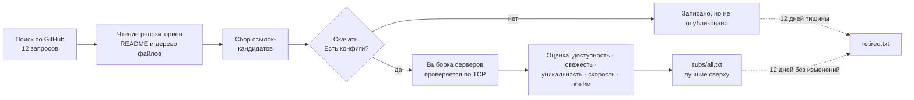

<div align="center">


# Бесплатные подписки V2Ray — VLESS, VMess, Trojan, Shadowsocks, Hysteria2

**Список, который пересобирается из измерений каждый день, а не собран один раз и брошен.**

Каждая ссылка здесь скачана, декодирована и доказала, что несёт рабочие конфиги. Каждый
прокси открыл настоящий TLS-туннель к GitHub, прежде чем попасть в файл. Ничего не принято
на веру.

<p>
<a href="https://raw.githubusercontent.com/morpheusadam/v2ray-config/main/subs/all.txt"></a>
<a href="https://raw.githubusercontent.com/morpheusadam/v2ray-config/main/proxies/all.txt"></a>
<a href="subs/STATUS.md"></a>
</p>

[](subs/all.txt)
[](proxies/all.txt)
[](proxies/STATUS.md)

[](../../actions)
[](../../commits/main)

[English](README.md) · [فارسی](README.fa.md) · **Русский** · [中文](README.zh.md)

</div>

---

## Взять подписку

Скопируйте одну из ссылок в клиент. Это вся настройка.

**Каталог подписок** — список источников, лучшие сверху:

```
https://raw.githubusercontent.com/morpheusadam/v2ray-config/main/subs/all.txt
```

**Список прокси** — HTTP, SOCKS4a и SOCKS5, которые дотягиваются до GitHub из-под блокировки:

```
https://raw.githubusercontent.com/morpheusadam/v2ray-config/main/proxies/all.txt
```

> [!IMPORTANT]
> `subs/all.txt` — это список **ссылок на подписки**, а не список серверов. Большинству
> клиентов нужна одна ссылка, которая сама возвращает конфиги: для них возьмите любую
> строку из [таблицы лучших](#лучшие-источники-прямо-сейчас) ниже. Если ваш клиент умеет
> импортировать файл со ссылками (v2rayV, v2rayN, массовый импорт в NekoBox) — отдайте ему
> каталог целиком.

### Зеркала, если raw.githubusercontent.com заблокирован

```
https://cdn.jsdelivr.net/gh/morpheusadam/v2ray-config@main/subs/all.txt
https://raw.githack.com/morpheusadam/v2ray-config/main/subs/all.txt
```

Те же байты с других хостов. Списки блокировок, знающие raw-хост, обычно не знают эти.

---

## Живые цифры

<!-- SUBS-STATS:START -->
| | |
|---|---|
| **Live subscription links** | 1550 |
| **Links on record** | 3123 |
| **Configs behind them** | 384,266+ |
| **Last rebuild** | 2026-08-10T22:42:25Z |
<!-- SUBS-STATS:END -->

<!-- PROXY-STATS:START -->
| | |
|---|---|
| **Proxies in the list** | 263 |
| **Reached GitHub on re-check** | 43% (115 of 266 drawn at random) |
| **Protocols** | http 160, socks5 90, socks4 13 |
| **Last rebuild** | 2026-08-10T21:10:22Z |
<!-- PROXY-STATS:END -->

Полные таблицы с историей и датами по каждой ссылке: [subs/STATUS.md](subs/STATUS.md) ·
[proxies/STATUS.md](proxies/STATUS.md)

---

## Какой клиент?

| Клиент | Платформа | Как |
|---|---|---|
| [v2rayV](https://github.com/morpheusadam/v2rayV) | Android | Сделан под этот список. Одно нажатие — сам импортирует, тестирует и подключается. |
| [v2rayN-Pro-Max](https://github.com/morpheusadam/v2rayN-Pro-Max) | Windows, Linux | Настольный собрат, где Auto Mode и появился. Тоже сделан под этот список. |
| [v2rayNG](https://github.com/2dust/v2rayNG) | Android | Подписки → **+** → вставить ссылку |
| [v2rayN](https://github.com/2dust/v2rayN) | Windows, macOS, Linux | Subscriptions → Add → вставить |
| [NekoBox](https://github.com/MatsuriDayo/NekoBoxForAndroid) | Android | Groups → **+** → Subscription |
| [Hiddify](https://github.com/hiddify/hiddify-next) | Все | New profile → From URL |
| [sing-box](https://github.com/SagerNet/sing-box) | Все | Через любой конвертер подписок |
| [Clash Meta / Mihomo](https://github.com/MetaCubeX/mihomo) | Все | Нужен конвертер — здесь сырые URI, не Clash YAML |
| [Streisand](https://apps.apple.com/app/streisand/id6450534064) · [V2Box](https://apps.apple.com/app/v2box-v2ray-client/id6446814690) | iOS | Add subscription → вставить |

---

## Лучшие источники прямо сейчас

По оценке ниже, пересчитывается каждый день. Любую из них можно вставить в клиент напрямую.

<!-- SUBS-TOP:START -->
| # | Score | Subscription link | Configs | Reachable |
|---|---|---|---|---|
| 1 | **99** | `https://raw.githubusercontent.com/coldwater-10/V2ray-Config/main/Splitted-By-Protocol/trojan.txt` | 324 | 100% |
| 2 | **98** | `https://raw.githubusercontent.com/Delta-Kronecker/V2ray-Config/refs/heads/main/config/tcp-pass/batch_013.txt` | 413 | 100% |
| 3 | **96** | `https://raw.githubusercontent.com/sevcator/5ubscrpt10n/main/mini/m1n1-5ub-69.txt` | 390 | 100% |
| 4 | **96** | `https://raw.githubusercontent.com/coldwater-10/V2ray-Config/main/Sub7.txt` | 586 | 100% |
| 5 | **95** | `https://raw.githubusercontent.com/Delta-Kronecker/V2ray-Config/refs/heads/main/config/tcp-pass/batch_015.txt` | 293 | 100% |
| 6 | **94** | `https://raw.githubusercontent.com/Delta-Kronecker/V2ray-Config/refs/heads/main/config/tcp-pass/batch_001.txt` | 360 | 100% |
| 7 | **94** | `https://raw.githubusercontent.com/nikita29a/FreeProxyList/refs/heads/main/mirror/25.txt` | 218 | 100% |
| 8 | **94** | `https://raw.githubusercontent.com/Delta-Kronecker/V2ray-Config/refs/heads/main/config/tcp-pass/batch_003.txt` | 354 | 100% |
| 9 | **94** | `https://raw.githubusercontent.com/coldwater-10/V2ray-Config/main/Sub6.txt` | 598 | 100% |
| 10 | **94** | `https://raw.githubusercontent.com/liketolivefree/kobabi/main/sub_all.txt` | 538 | 100% |
| 11 | **94** | `https://raw.githubusercontent.com/coldwater-10/V2ray-Config/main/Sub4.txt` | 608 | 100% |
| 12 | **94** | `https://raw.githubusercontent.com/coldwater-10/V2ray-Config/main/Sub3.txt` | 612 | 100% |
| 13 | **94** | `https://raw.githubusercontent.com/Delta-Kronecker/V2ray-Config/refs/heads/main/config/tcp-pass/batch_014.txt` | 292 | 100% |
| 14 | **94** | `https://raw.githubusercontent.com/Delta-Kronecker/V2ray-Config/refs/heads/main/config/tcp-pass/batch_004.txt` | 422 | 100% |
| 15 | **93** | `https://raw.githubusercontent.com/Delta-Kronecker/V2ray-Config/refs/heads/main/config/tcp-pass/batch_010.txt` | 330 | 100% |
<!-- SUBS-TOP:END -->

Полный ранжированный список всех источников — в [`subs/all.txt`](subs/all.txt).

---

## Как это собирается



Всё это — один файл на Python, [`harvest.py`](harvest.py), только стандартная библиотека,
запускается раз в сутки через [GitHub Actions](.github/workflows/daily.yml). Ни серверов,
ни базы, ни ключей API.

### Оценка

Порядок здесь не украшение. Источники сортируются числом от 0 до 100:

```
0.34·reach + 0.20·freshness + 0.14·clean + 0.12·speed + 0.12·volume + 0.08·modern
```

| Часть | Что измеряет |
|---|---|
| **reach** | Доля случайной выборки серверов, завершивших TCP-рукопожатие |
| **freshness** | Дней с последнего изменения *декодированного* содержимого. Перекодирование тех же серверов изменением не считается |
| **clean** | Наполовину — насколько мало список повторяет сам себя, наполовину — насколько мало повторяет остальных |
| **speed** | Медиана времени рукопожатия. Вес намеренно низкий — см. ниже |
| **volume** | Сколько конфигов несёт, с насыщением на 300 |
| **modern** | Reality, TLS, Hysteria2 и TUIC вместо голого VMess поверх TCP |

**Почему скорость почти не учитывается.** Ранжирование серверов по пингу оказалось *хуже
случайного*. Самыми быстрыми отвечали CDN-узлы перед мёртвыми хостами: рукопожатие за 20 мс
и ноль трафика. Рабочее соединение предсказывают доступность и свежесть, а задержка в
основном показывает, насколько близко стоит балансировщик.

### Двенадцать дней — и на выход

Ссылка, которая 12 дней не отвечает или 12 дней не меняется, уходит из файла. Не удаляется —
попадает в [`subs/retired.txt`](subs/retired.txt) с датой и причиной, чтобы вернувшийся
источник узнали, а не открыли заново как незнакомца. Новая ссылка неприкосновенна, пока за
ней не наблюдали столько же: «не менялась 12 дней» — утверждение о наблюдении, а в первый
день наблюдения нет.

---

## Список прокси — другая задача

[`proxies/all.txt`](proxies/all.txt) существует ради одного: дотянуться до GitHub из сети,
где он закрыт, чтобы клиент вообще смог скачать список подписок.

Поэтому обычная проверка прокси здесь бесполезна. Запись проходит, только если открывает
TLS-туннель к `raw.githubusercontent.com:443` **по имени**, отправляет `Range: bytes=0-15`
и получает байты обратно — всё за восемь секунд. Отсюда:

- SOCKS5 обязан принимать доменное имя. В сети, где DNS отвечает ложью, передача прокси
  готового IP лишает всю затею смысла.
- SOCKS4 обязан быть **SOCKS4a**. Обычный SOCKS4 не умеет передавать имя хоста.
- HTTP обязан разрешать `CONNECT` на 443. Прокси, позволяющие только `GET` — самый частый
  ложноположительный результат наивной проверки, и их очень много.

Значение имеет **плотность**: сколько записей из случайной выборки файла всё ещё работают на
втором проходе. Она измеряется на каждом запуске и пишется в заголовок самого файла.
Количество — не качество: маленький список, где работает половина, лучше огромного, где не
работает ничего.

Формат — со всегда указанной схемой, потому что помеченная запись стоит клиенту одного
рукопожатия, а голая — трёх:

```
socks5://1.2.3.4:1080 | DE | 412ms | 12d
http://5.6.7.8:3128 | NL | 780ms | 3d
```

Всё после первого `|` или пробела — метаданные, клиенты их игнорируют.

---

## Добавить свои источники

Два обычных текстовых файла, оба правятся руками:

- [`rapo.txt`](rapo.txt) — репозитории GitHub, из которых берутся ссылки, по одному
  `https://github.com/owner/repo` в строке.
- [`proxies/sources.txt`](proxies/sources.txt) — списки прокси, по одному URL в строке.

Добавьте строку, откройте pull request. Следующий суточный запуск подхватит её, проверит и
поставит в общий рейтинг. Источник, переставший работать, отдельно отмечается в
[proxies/STATUS.md](proxies/STATUS.md), а не проваливается молча — именно так при первом
запуске нашлись три мёртвых источника.

Можно запускать и локально:

```bash
python harvest.py subs search       # искать новые репозитории на GitHub
python harvest.py subs run          # собрать, проверить, ранжировать, переписать
python harvest.py proxies run       # весь блок прокси
python harvest.py subs status       # напечатать текущий рейтинг
python harvest.py daily             # всё сразу, как в CI
```

Python 3.10+, без зависимостей. `GITHUB_TOKEN` не обязателен и только поднимает лимиты API.

Полная техническая спецификация: [standard.md](standard.md) · Контракт по прокси:
[proxies/PROMPT.md](proxies/PROMPT.md)

---

## Частые вопросы

<details>
<summary><b>Это бесплатно? В чём подвох?</b></summary>

Бесплатно, без аккаунта, без регистрации, без телеметрии. Ни один из этих серверов не
принадлежит проекту — это публичные конфиги, опубликованные другими людьми, собранные и
проверенные здесь. Подвох в самой природе: бесплатный публичный сервер общий,
непредсказуемый и может исчезнуть за ночь. Ровно поэтому всё пересобирается ежедневно.
</details>

<details>
<summary><b>Как часто обновляется?</b></summary>

Раз в 24 часа, в 03:20 UTC, автоматически. Бейдж наверху читается вживую из последнего
запуска — если он устарел, значит задача сломалась, и это видно.
</details>

<details>
<summary><b>Какие протоколы?</b></summary>

VLESS (включая Reality и XTLS), VMess, Trojan, Shadowsocks, ShadowsocksR, Hysteria,
Hysteria2, TUIC, AnyTLS, Juicity, WireGuard и SOCKS — всё, что публикуют источники. Оценка
отдаёт предпочтение Reality, TLS и Hysteria2: они переживают активное зондирование, а голый
VMess поверх TCP всё чаще нет.
</details>

<details>
<summary><b>Почему клиент пишет «нет серверов»?</b></summary>

Почти всегда потому, что `subs/all.txt` вставили в клиент, ожидающий ссылку с конфигами. Это
файл *со ссылками*. Возьмите строку из [таблицы лучших](#лучшие-источники-прямо-сейчас) или
клиент, умеющий импортировать каталог.
</details>

<details>
<summary><b>Работает в России, Иране, Китае?</b></summary>

Ссылки работают, если вы дотянулись до GitHub — а это и есть сложная часть. Для неё и нужны
зеркала и список прокси. Доступность *из* цензурируемой сети до конкретного сервера —
единственное, что нельзя проверить с раннера в Европе, поэтому читайте рейтинг как «эти
серверы живы», а не «эти серверы живы оттуда, где вы».
</details>

<details>
<summary><b>Можно использовать не в VPN-клиенте?</b></summary>

Список прокси — обычные HTTP/SOCKS, работают везде, где работает прокси. Только не наводите
на них скрапер: это чужие серверы, и именно так они исчезают.
</details>

---

## Юридически и честно

Опубликовано для исследований, обучения и доступа к открытому интернету там, где он
ограничен. Ничто здесь не принадлежит проекту, не управляется и не одобряется им; каждая
запись — публичный конфиг, опубликованный кем-то другим и собранный автоматически. Никакой
трафик не проходит через то, что контролирую я, и я не могу поручиться за операторов этих
серверов — исходите из того, что бесплатный публичный прокси видит ваш трафик, и используйте
сквозное шифрование для всего важного.

Соблюдайте применимые к вам законы. Лицензия [MIT](LICENSE).

---

<div align="center">

**Сделано вместе с [v2rayV](https://github.com/morpheusadam/v2rayV)** — Android-клиентом,
который читает этот список и подключается сам за одно нажатие.

Если это сэкономило вам вечер, ⭐ поможет другим это найти.

<sub>Ключевые слова: бесплатный впн конфиг · подписка v2ray · vless подписка · vmess
бесплатно · trojan конфиг · shadowsocks бесплатно · hysteria2 · reality конфиг · обход
блокировок · бесплатные прокси socks5 · free v2ray config · کانفیگ رایگان · 免费节点</sub>

</div>
