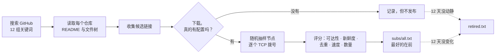

<div align="center">


# 免费 V2Ray 订阅链接 — VLESS、VMess、Trojan、Shadowsocks、Hysteria2

**每天用实测结果重新生成的订阅列表，而不是抓一次就扔在那里。**

这里每一条链接都被下载、解码，并证明确实带着可用的配置。每一个代理都先打通了到 GitHub 的
真实 TLS 隧道才被放进来。没有任何一条是靠信任进来的。

<p>
<a href="https://raw.githubusercontent.com/morpheusadam/v2ray-config/main/subs/all.txt"></a>
<a href="https://raw.githubusercontent.com/morpheusadam/v2ray-config/main/proxies/all.txt"></a>
<a href="subs/STATUS.md"></a>
</p>

[](subs/all.txt)
[](proxies/all.txt)
[](proxies/STATUS.md)

[](../../actions)
[](../../commits/main)

[English](README.md) · [فارسی](README.fa.md) · [Русский](README.ru.md) · **中文**

</div>

---

## 获取订阅

把下面任意一条复制进客户端，配置就结束了。

**订阅目录** — 按质量排序的源列表，最好的在最前：

```
https://raw.githubusercontent.com/morpheusadam/v2ray-config/main/subs/all.txt
```

**代理列表** — 能在被封锁的网络里连上 GitHub 的 HTTP、SOCKS4a、SOCKS5：

```
https://raw.githubusercontent.com/morpheusadam/v2ray-config/main/proxies/all.txt
```

> [!IMPORTANT]
> `subs/all.txt` 是一份**订阅链接的清单**，不是节点清单。多数客户端要的是一条能直接返回配置的
> 链接 — 那就从下面的[排行榜](#当前最好的源)里挑一行贴进去。如果你的客户端支持批量导入链接文件
> （v2rayV、v2rayN、NekoBox 的批量导入），直接把目录交给它。

### 如果 raw.githubusercontent.com 在你那里被墙

```
https://cdn.jsdelivr.net/gh/morpheusadam/v2ray-config@main/subs/all.txt
https://raw.githack.com/morpheusadam/v2ray-config/main/subs/all.txt
```

同样的内容，不同的域名。封锁名单认得 raw 主机，通常认不得这几个。

---

## 实时数据

<!-- SUBS-STATS:START -->
| | |
|---|---|
| **Live subscription links** | 1552 |
| **Links on record** | 3123 |
| **Configs behind them** | 383,344+ |
| **Last rebuild** | 2026-08-10T22:07:29Z |
<!-- SUBS-STATS:END -->

<!-- PROXY-STATS:START -->
| | |
|---|---|
| **Proxies in the list** | 263 |
| **Reached GitHub on re-check** | 43% (115 of 266 drawn at random) |
| **Protocols** | http 160, socks5 90, socks4 13 |
| **Last rebuild** | 2026-08-10T21:10:22Z |
<!-- PROXY-STATS:END -->

完整榜单，含每条链接的历史与日期：[subs/STATUS.md](subs/STATUS.md) ·
[proxies/STATUS.md](proxies/STATUS.md)

---

## 用哪个客户端

| 客户端 | 平台 | 怎么用 |
|---|---|---|
| [v2rayV](https://github.com/morpheusadam/v2rayV) | Android | 专为这份列表做的。按一次电源键，自己导入、测速、连上 |
| [v2rayN-Pro-Max](https://github.com/morpheusadam/v2rayN-Pro-Max) | Windows、Linux | 桌面版兄弟项目，Auto Mode 最早就在这里。同样是为这份列表做的。 |
| [v2rayNG](https://github.com/2dust/v2rayNG) | Android | 订阅设置 → **+** → 粘贴链接 |
| [v2rayN](https://github.com/2dust/v2rayN) | Windows、macOS、Linux | Subscriptions → Add → 粘贴 |
| [NekoBox](https://github.com/MatsuriDayo/NekoBoxForAndroid) | Android | Groups → **+** → Subscription |
| [Hiddify](https://github.com/hiddify/hiddify-next) | 全平台 | New profile → From URL |
| [sing-box](https://github.com/SagerNet/sing-box) | 全平台 | 用任意订阅转换工具 |
| [Clash Meta / Mihomo](https://github.com/MetaCubeX/mihomo) | 全平台 | 需要转换器 — 这里发布的是原始 URI，不是 Clash YAML |
| [Streisand](https://apps.apple.com/app/streisand/id6450534064) · [V2Box](https://apps.apple.com/app/v2box-v2ray-client/id6446814690) | iOS | Add subscription → 粘贴 |

---

## 当前最好的源

按下面的评分排序，每天重算。任意一条都可以直接贴进客户端。

<!-- SUBS-TOP:START -->
| # | Score | Subscription link | Configs | Reachable |
|---|---|---|---|---|
| 1 | **98** | `https://raw.githubusercontent.com/Delta-Kronecker/V2ray-Config/refs/heads/main/config/tcp-pass/batch_013.txt` | 413 | 100% |
| 2 | **96** | `https://raw.githubusercontent.com/coldwater-10/V2ray-Config/main/Splitted-By-Protocol/trojan.txt` | 324 | 92% |
| 3 | **96** | `https://raw.githubusercontent.com/Delta-Kronecker/V2ray-Config/refs/heads/main/config/tcp-pass/batch_014.txt` | 292 | 100% |
| 4 | **95** | `https://raw.githubusercontent.com/sevcator/5ubscrpt10n/main/mini/m1n1-5ub-69.txt` | 390 | 100% |
| 5 | **95** | `https://raw.githubusercontent.com/Delta-Kronecker/V2ray-Config/refs/heads/main/config/tcp-pass/batch_015.txt` | 293 | 100% |
| 6 | **94** | `https://raw.githubusercontent.com/Delta-Kronecker/V2ray-Config/refs/heads/main/config/tcp-pass/batch_003.txt` | 354 | 100% |
| 7 | **94** | `https://raw.githubusercontent.com/liketolivefree/kobabi/main/sub_all.txt` | 538 | 100% |
| 8 | **94** | `https://raw.githubusercontent.com/TheCrowCreature/v2rayExtractor/refs/heads/main/trojan.html` | 335 | 100% |
| 9 | **94** | `https://raw.githubusercontent.com/Delta-Kronecker/V2ray-Config/refs/heads/main/config/tcp-pass/batch_001.txt` | 360 | 100% |
| 10 | **94** | `https://raw.githubusercontent.com/Delta-Kronecker/V2ray-Config/refs/heads/main/config/tcp-pass/batch_007.txt` | 464 | 100% |
| 11 | **94** | `https://raw.githubusercontent.com/Delta-Kronecker/V2ray-Config/refs/heads/main/config/tcp-pass/batch_011.txt` | 434 | 100% |
| 12 | **94** | `https://raw.githubusercontent.com/10Dream/sub-mod/main/sub/normal/10ium-telegram-configs-collector-trojan` | 331 | 100% |
| 13 | **94** | `https://raw.githubusercontent.com/Delta-Kronecker/V2ray-Config/refs/heads/main/config/tcp-pass/batch_010.txt` | 330 | 100% |
| 14 | **94** | `https://raw.githubusercontent.com/Delta-Kronecker/V2ray-Config/refs/heads/main/config/tcp-pass/batch_002.txt` | 406 | 100% |
| 15 | **94** | `https://raw.githubusercontent.com/Delta-Kronecker/V2ray-Config/refs/heads/main/config/tcp-pass/batch_009.txt` | 488 | 100% |
<!-- SUBS-TOP:END -->

全部源的完整排名在 [`subs/all.txt`](subs/all.txt)。

---

## 它是怎么生成的



整套东西就是一个 Python 文件 [`harvest.py`](harvest.py)，只用标准库，由
[GitHub Actions](.github/workflows/daily.yml) 每天跑一次。没有服务器，没有数据库，不需要
API key。

### 评分

排序不是装饰。每个源都有一个 0–100 的分数：

```
0.34·reach + 0.20·freshness + 0.14·clean + 0.12·speed + 0.12·volume + 0.08·modern
```

| 项 | 衡量什么 |
|---|---|
| **reach** | 随机抽样的节点里，有多少完成了 TCP 握手 |
| **freshness** | 距离*解码后*内容上次变化过去了几天。把同一批节点重新编码一遍不算变化 |
| **clean** | 一半看它自己重复多少，一半看它和别人重复多少 |
| **speed** | 握手时间中位数。权重故意压低，原因见下 |
| **volume** | 带多少条配置，300 条封顶 |
| **modern** | Reality、TLS、Hysteria2、TUIC，而不是裸 VMess over TCP |

**为什么速度几乎不算数。** 按 ping 给节点排序，在这里实测下来*比随机还差*。响应最快的往往是
挡在死主机前面的 CDN 边缘：20 毫秒完成握手，一个字节也过不去。真正预示连接可用的是可达性和
新鲜度；延迟大多只说明负载均衡器离你有多近。

### 十二天，然后出局

一条链接连续 12 天不响应、或者 12 天内容毫无变化，就会离开这个文件。它不会被删除 —— 带着日期
和原因进入 [`subs/retired.txt`](subs/retired.txt)，这样它哪天回来时是被认出来，而不是当成陌生
人重新发现。新发现的链接在被观察满同样天数之前是豁免的：“12 天没变化”是一个关于观察的判断，而
第一天根本没有观察。

---

## 代理列表是另一个问题

[`proxies/all.txt`](proxies/all.txt) 只为一件事存在：在 GitHub 被封的网络里够到 GitHub，好让
客户端至少能把订阅列表下下来。

所以常规的代理检测在这里没用。一条记录只有做到这些才算通过：**按域名**打通到
`raw.githubusercontent.com:443` 的 TLS 隧道，发送 `Range: bytes=0-15`，拿到字节返回，全程八秒
以内。因此：

- SOCKS5 必须接受域名地址类型。在 DNS 会撒谎的网络里，直接把 IP 交给代理等于自废武功。
- SOCKS4 必须是 **SOCKS4a**。普通 SOCKS4 根本没法携带主机名。
- HTTP 必须允许 `CONNECT` 到 443。只放行 `GET` 的代理是简易检测器最常见的假阳性，而且数量极多。

真正重要的数字是**密度**：从文件里随机抽一批，第二遍还能用的有多少。每次运行都会实测，并写进文件
自己的头部。数量不等于质量 —— 一份一半能用的小列表，胜过一份全都不能用的大列表。

格式如下，协议头永远写出来，因为带标注的记录只要客户端握手一次，不带的要三次：

```
socks5://1.2.3.4:1080 | DE | 412ms | 12d
http://5.6.7.8:3128 | NL | 780ms | 3d
```

第一个 `|` 或空格之后的内容都是元数据，客户端会忽略。

---

## 添加你自己的源

两个纯文本文件，都可以手改：

- [`rapo.txt`](rapo.txt) — 要挖订阅链接的 GitHub 仓库，每行一个
  `https://github.com/owner/repo`。
- [`proxies/sources.txt`](proxies/sources.txt) — 要抓的代理列表，每行一个 URL。

加一行，提个 pull request。第二天的运行会自动接管它、验证它，并和其他源一起排名。失效的源会在
[proxies/STATUS.md](proxies/STATUS.md) 里逐条报告，而不是悄悄失败 —— 第一次运行时正是这样抓出
三个已经死掉的源。

你也可以自己跑：

```bash
python harvest.py subs search       # 在 GitHub 上找新仓库
python harvest.py subs run          # 收集、验证、排名、重写
python harvest.py proxies run       # 整个代理流程
python harvest.py subs status       # 打印当前排名
python harvest.py daily             # 全套，也就是 CI 跑的那条
```

Python 3.10+，零依赖。`GITHUB_TOKEN` 可选，只是用来提高 API 限额。

完整技术规范：[standard.md](standard.md) · 代理契约：[proxies/PROMPT.md](proxies/PROMPT.md)

---

## 常见问题

<details>
<summary><b>免费吗？有什么坑？</b></summary>

免费，不需要账号，不需要注册，没有埋点。这些节点没有一个是本项目运营的 —— 都是别人公开发布的
配置，在这里被收集和检测。坑是天生的：免费公共节点是共享的、不可预测的，可能一夜之间消失。正因
如此才需要每天重建。
</details>

<details>
<summary><b>多久更新一次？</b></summary>

每 24 小时一次，UTC 03:20，自动。顶部徽章是从最后一次运行实时读的，如果它过期了，说明任务坏了，
你一眼就能看见。
</details>

<details>
<summary><b>支持哪些协议？</b></summary>

VLESS（含 Reality 与 XTLS）、VMess、Trojan、Shadowsocks、ShadowsocksR、Hysteria、Hysteria2、
TUIC、AnyTLS、Juicity、WireGuard 和 SOCKS —— 上游源发什么就有什么。评分偏向 Reality、TLS 和
Hysteria2，因为它们扛得住主动探测，而裸 VMess over TCP 越来越扛不住。
</details>

<details>
<summary><b>为什么客户端提示没有节点？</b></summary>

几乎都是因为把 `subs/all.txt` 贴进了一个期待“链接直接返回配置”的客户端。那个文件是一份*链接*
清单。要么从[排行榜](#当前最好的源)里挑一条，要么换一个支持导入目录的客户端。
</details>

<details>
<summary><b>在中国、伊朗、俄罗斯能用吗？</b></summary>

链接本身能用，前提是你够得到 GitHub —— 而这恰恰是最难的一步，镜像和代理列表就是为它准备的。从
被审查的网络*到*某个节点的这一段，是欧洲的 CI 机器无法测的，所以请把排名读作“这些节点是活的”，
而不是“这些节点从你那里是活的”。
</details>

<details>
<summary><b>能用在 VPN 客户端以外的地方吗？</b></summary>

代理列表就是普通的 HTTP/SOCKS，凡是能用代理的地方都能用。但请不要拿它去跑爬虫 —— 这些是别人的
服务器，往死里用正是它们消失的原因。
</details>

---

## 法律与实话

发布用于研究、教育，以及在受限地区访问开放互联网。这里的一切都不由本项目拥有、运营或背书；每一条
都是别人公开发布、被自动收集来的配置。没有任何流量经过我控制的设备，我也无法为这些运营者的行为
担保 —— 请默认一个免费公共代理看得见你的流量，重要的东西一律走端到端加密。

请遵守适用于你的法律。以 [MIT](LICENSE) 授权。

---

<div align="center">

**与 [v2rayV](https://github.com/morpheusadam/v2rayV) 一起开发** —— 一个读取这份列表、按一次
就自己连上的 Android 客户端。

如果它替你省下了一个下午，点个 ⭐ 能让更多人找到它。

<sub>关键词：免费节点 · v2ray 订阅 · vless 订阅 · vmess 免费 · trojan 节点 · shadowsocks 免费 ·
hysteria2 · reality 配置 · 科学上网 · 免费机场 · 白嫖节点 · socks5 代理列表 ·
free v2ray config · کانفیگ رایگان · бесплатный впн конфиг</sub>

</div>
